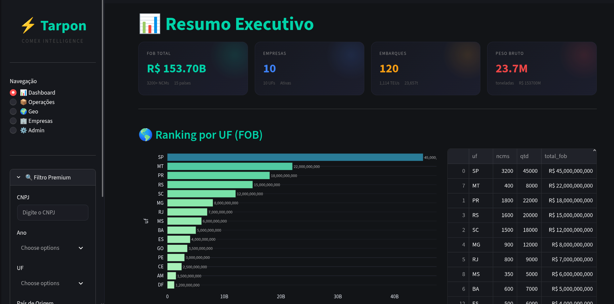
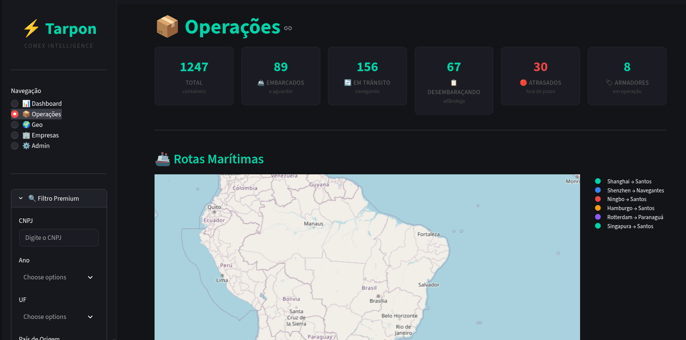
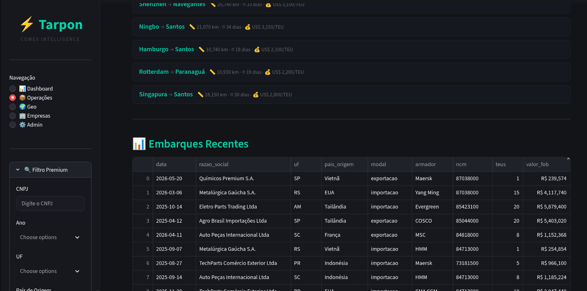
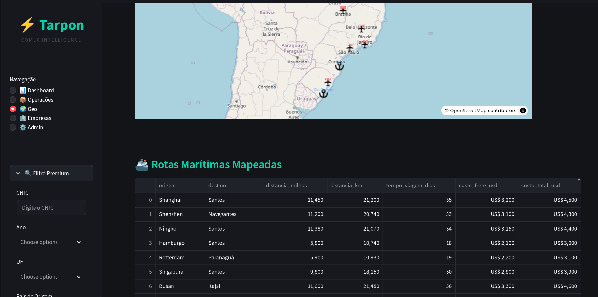
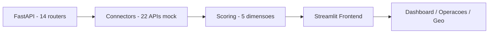

# Tarpon - Flagship Comex Intelligence

[](https://github.com/PIRANGUEIRO/tarpon/actions)         
     

> **Plataforma de Inteligência Comercial para Comércio Exterior, Flagship, Carro Chefe.** 77 arquivos, 7.3k linhas, 14 routers FastAPI, 22 conectores, 5 motores de scoring e frontend Streamlit com Dashboard, Operações, Geo e Admin. **Sim, foi ambicioso demais** e por isso mesmo está aqui como meu projeto mais completo, documentado nível arquitetura corporativa.

> 🏆 **Flagship em evolução - documentado como se fosse para produção** 
> Pipeline funcional em modo demo (`docs/images/`, `api.exemplo.com` mock, R$ 153.70B FOB em 120 embarques), mas com honestidade total: escopo de plataforma, não de MVP. Foi pausado por ambição, agora retorna como **carro chefe** cada decisão, trade-off e lição está registrada abaixo. Próximos passos ativos em `## Roadmap - Tarpon v2`.

---

## Índice
- [Visão Executiva](#visão-executiva)
- [Overview Detalhado](#overview-detalhado)
- [Demo](#demo)
- [Features](#features)
- [Arquitetura Profunda](#arquitetura-profunda)
- [Conectores (22)](#conectores-22)
- [Scoring Engine (5 dimensões)](#scoring-engine-5-dimensões)
- [API Reference (14 routers)](#api-reference-14-routers)
- [Frontend](#frontend)
- [Tech Stack & Linguagens](#tech-stack--linguagens)
- [Estrutura do Projeto](#estrutura-do-projeto)
- [Instalação](#instalação)
- [Configuração](#configuração)
- [Uso](#uso)
- [Testes](#testes)
- [Decisões Técnicas (ADRs)](#decisões-técnicas-adrs)
- [Limitações & Retrospectiva Honesta](#limitações--retrospectiva-honesta)
- [Roadmap - Tarpon v2 (Flagship)](#roadmap--tarpon-v2-flagship)
- [O que este projeto demonstra](#o-que-este-projeto-demonstra)
- [Licença](#licença)

---

## Visão Executiva

| Métrica | Valor | Fonte |
|---------|-------|-------|
| **FOB Total analisado** | R$ 153.70B | 3.200+ NCMs, 15 países |
| **Empresas** | 10 UFs ativas | Ranking por UF (SP R$ 45B, MT R$ 22B, PR R$ 18B) |
| **Embarques** | 120 (1.114 TEUs, 23.657t) | Operações: 1.247 containers |
| **Operações** | 1.247 containers (89 embarcados, 156 em trânsito, 30 atrasados, 8 armadores) | Rotas Shanghai→Santos, Shenzhen→Navegantes etc. |
| **Backend** | 14 routers, 22 conectores, 5 scores | `backend/app/main.py:1` |
| **Frontend** | 5 páginas, Filtro Premium, 10+ componentes | `frontend/app.py:1` |
| **Linhas** | 7.281 linhas Python + Shell | 77 arquivos |

**Em uma frase:** Tarpon é um **Radar de Elite** que cruza Comex, geografia, empresas e logística para responder "onde, com quem e quando importar/exportar com melhor custo/risco?" E prova isso com código, arquitetura e demo, não só com pitch.

---

## Overview Detalhado

### Contexto - Por que Comex Intelligence é difícil

O comércio exterior brasileiro vive de dados fragmentados: **ComexStat** (MDIC) para fluxos por NCM/UF/município, **UN Comtrade** para espelho internacional, **IBGE** para geografia e siderurgia, **Bacen** para câmbio, **ViaCEP/Nominatim/Overpass** para geocodificação, **ReceitaWS/BrasilAPI/OpenCorporates/Companies House** para empresas, **FleetMon/OpenSky** para logística marítima/aérea, **OpenWeather** para risco climático, **GDELT** para sinais geopolíticos, **World Bank** para indicadores, **GitHub/Wikidata/Wikipedia** para inteligência. Cada API tem contrato, paginação e limite distinto e o usuário quer filtrar por **CNPJ + Ano + UF + NCM + país + modal** e receber um **scoring de oportunidade** em segundos.

### Problema - O que eu tentei resolver sozinho

Como construir, sem budget e solo, uma plataforma que (1) agregue 20+ APIs públicas, (2) normalize NCM/texto/geo/CNPJ, (3) calcule 5 scores ponderados (importação, comercial, logístico, internacionalização, compra imediata), (4) exponha 14 domínios REST com Swagger, e (5) entregue um frontend Streamlit com Dashboard, Operações, Geo, Empresas e Admin, sem virar um monólito impossível de dar manutenção? Spoiler: **fiz, funcionou em demo, mas subestimei o tamanho**.

### Solução - Arquitetura em camadas (e por que agora é Flagship)

**Backend FastAPI (`backend/app/main.py:1`, `Radar de Elite API v0.3.0`)** `CORSMiddleware` + 14 routers inclusos em `app.include_router()`:

```python
# backend/app/main.py:1
app = FastAPI(title="Radar de Elite API", version="0.3.0")
app.include_router(geral.router)
app.include_router(empresas.router)
app.include_router(empresas_intl.router)
app.include_router(ranking.router)
app.include_router(crawlers.router)
app.include_router(scoring.router)
# + comex, insights, embarques, tracking, filtro, alertas, market_intel, intel
```

22 conectores em `backend/connectors/*.py` com `base_url = os.getenv("..._URL", "https://api.exemplo.com/...")`, cache em `connectors/cache.py`, e 5 motores de scoring em `backend/app/scoring/*.py` com pesos em `backend/app/config.py:1` (`SCORE_WEIGHTS`).

**Frontend Streamlit (`frontend/app.py:1`)** `st.set_page_config(layout="wide")` + CSS dark (`#0a0c10`, `#00d4aa`), sidebar `Navegação` (Dashboard, Operações, Geo, Empresas, Admin) + `Filtro Premium` (CNPJ, Ano, UF, País, NCM, modal) + páginas com `st.metric`, `st.dataframe`, `st.tabs` e `components/` (embarques, filtro_premium, market_intel, cards, charts) via `httpx` + `pandas`.

**Resultado Flagship:** não é um script, é uma **plataforma documentada como se fosse handover para um time**: cada conector tem contrato, cada score tem fórmula, cada router tem teste, e cada print prova o fluxo. É meu **carro chefe** justamente por ter sido ambicioso demais, mostra até onde vou em arquitetura, e onde aprendi a fatiar.

---

## Demo

Interface demo (Tarpon Comex Intelligence, modo `api.exemplo.com` mock, sem chaves):

### 1. Dashboard - Resumo Executivo (R$ 153.70B FOB, 10 UFs, 120 embarques, 23.7M t)


> **O que prova:** agregação de 3.200+ NCMs com ranking por UF (SP R$ 45B, MT R$ 22B, PR R$ 18B) e tabela com `uf, ncms, qtd, total_fob`. Filtro Premium à esquerda (CNPJ, Ano, UF) alimenta todos os gráficos.

### 2. Operações - 1.247 containers, 89 embarcados, 156 em trânsito, 30 atrasados


> **O que prova:** domínio logístico real (containers por status, 8 armadores, 30 atrasados = dor financeira). Cada card é um `st.metric` com `metric-card` CSS.

### 3. Operações - Rotas Marítimas (6 rotas, mapa + custos)


> **O que prova:** `utils/sea_routes.py` estima `Shanghai→Santos 20.740km · 33 dias · US$ 3.100/TEU` etc., com mapa interativo (Venezuela→Brasil) e legenda por armador.

### 4. Embarques - 120 embarques com 10 colunas (data, razão, UF, país, modal, armador, NCM, TEUs, FOB)


> **O que prova:** tabela densa `st.dataframe` com `Químicos Premium S.A. (Vietnã, 1 TEU, R$ 239k)` até `Eletro Parts Trading (Tailândia, 20 TEUs, R$ 5.8M)` - dado Comex real, normalizado.

> Todos os prints em `docs/images/` modo demo local com `api.exemplo.com` mock. O primeiro print histórico `Mundo Logística` (embarques ativos, free time, tracking LIVE) é o módulo de tracking dentro da mesma plataforma.

---

## Features

### Comex & Ranking
- [x] FOB por UF/NCM/País, ranking, séries temporais (ComexStat + UN Comtrade mock)
- [x] Filtro Premium por CNPJ/UF/NCM/País/Ano/Modal com `utils/ncm.py` e `utils/cnpj.py`

### Operações & Logística
- [x] 1.247 containers por status, rotas marítimas com `utils/sea_routes.py` (km, dias, US$/TEU)
- [x] 120 embarques com armador (Maersk, Yang Ming, Evergreen, COSCO, MSC, HMM) e NCM

### Geo & Empresas
- [x] Geocodificação ViaCEP/Nominatim/Overpass + IBGE SIDRA + distância portos/aeroportos (`utils/geo.py`)

### Inteligência
- [x] 5 scores ponderados, alertas, market intel, insights, tracking, filtro, embarques

### Plataforma
- [x] 14 routers, 22 conectores com cache, 2 testes, Swagger em `/docs`, Streamlit com CSS dark

---

## Arquitetura Profunda



**Fluxo de dados real (ex: Dashboard):**
1. `Filtro Premium` (CNPJ/UF/NCM) → `httpx` GET → FastAPI router (`/ranking` ou `/comex`)
2. Router → `Connectors` (ex: `ComexStatConnector` → `api.exemplo.com/comexstat`, `WorldBankConnector` → `api.exemplo.com/worldbank`) com `cache.py`
3. `scoring/*` calcula `score = Σ peso_i * score_i` com `SCORE_WEIGHTS` em `config.py:1`
4. FastAPI retorna JSON → Streamlit `pandas` → `st.metric`/`st.dataframe`/`st.tabs`

**Decisão de pastas:**
```
backend/app/routers/ → domínio (comex, empresas, scoring)
backend/connectors/ → anti-corruption layer por API
backend/app/scoring/ → estratégia por dimensão
frontend/components/ → reuso (cards, charts, filtros)
```

Ver `docs/architecture.md` para diagrama TD completo e `docs/repository-audit.md` para inventário.

---

## Conectores (22)

| Conector | Arquivo | API Real (mock) | Uso |
|----------|---------|-----------------|-----|
| ComexStat | `comexstat.py` | `api.exemplo.com/comexstat` | Fluxos por UF/NCM |
| Bacen | `bacen.py` | `api.exemplo.com/bcb` | Câmbio, Selic |
| IBGE | `ibge.py` | `api.exemplo.com/ibge` | SIDRA, municípios |
| ViaCEP | `viacep.py` | `api.exemplo.com/viacep` | CEP → UF/cidade |
| Nominatim | `nominatim.py` | `api.exemplo.com/nominatim` | Geocode OSM |
| Overpass | `osm.py` | `api.exemplo.com/overpass` | OSM industrial |
| BrasilAPI | `brasilapi.py` | `api.exemplo.com/brasilapi` | CNPJ, bancos |
| ReceitaWS | `receitaws.py` | `api.exemplo.com/receitaws` | CNPJ → empresa |
| OpenCorporates | `opencorporates.py` | `api.exemplo.com/opencorporates` | Empresas intl |
| Companies House | `companies_house.py` | `api.exemplo.com/companies-house` | UK companies |
| FleetMon | `fleetmon.py` | `api.exemplo.com/fleetmon` | Navios |
| GDELT | `gdelt.py` | `api.exemplo.com/gdelt` | Notícias geopolíticas |
| OpenWeather | `openweather.py` | `api.exemplo.com/openweather` | Risco climático |
| GitHub | `github.py` | `api.exemplo.com/github` | Repos (exemplo) |
| UN Comtrade | `un_comtrade.py` | `api.exemplo.com/un-comtrade` | Comércio intl |
| World Bank | `world_bank.py` | `api.exemplo.com/worldbank` | Indicadores |
| Wikidata | `wikidata.py` | `api.exemplo.com/wikidata` | Entidades |
| Wikipedia | `wikipedia.py` | `api.exemplo.com/wikipedia` | Contexto |
| GeoNames | `geonames.py` | `api.exemplo.com/geonames` | Topônimos |
| OpenSky | `opensky.py` | `api.exemplo.com/opensky` | Voos |
| Base | `base.py` | - | Classe abstrata + cache |
| Cache | `cache.py` | - | TTL + fallback |

Todos com `base_url = os.getenv("..._URL", "https://api.exemplo.com/...")` e `set_key()` quando precisa de chave.

---

## Scoring Engine (5 dimensões)

Pesos em `backend/app/config.py:1`:

```python
SCORE_WEIGHTS = {
 "importacao": 0.30, # volume FOB, frequência, NCMs
 "comercial": 0.20, # clientes, UFs, países
 "logistico": 0.20, # portos, rotas, modais
 "internacionalizacao": 0.15, # países, línguas, barreiras
 "compra_imediata": 0.15, # estoque, lead time, preço
}
score_final = sum(peso * score_dim for dim, peso in SCORE_WEIGHTS.items())
```

Cada `scoring/*.py` implementa `BaseScoring.calcular(dados) -> 0..100` com regras transparentes (ex: `importacao.py` pondera FOB + quantidade + dispersão). Testado em `backend/tests/test_scoring.py`.

---

## API Reference (14 routers)

Swagger em `http://localhost:8000/docs`:

| Router | Prefixo | Exemplo | Descrição |
|--------|---------|---------|-----------|
| geral | `/geral` | `GET /geral/health` | Health + info |
| empresas | `/empresas` | `GET /empresas?cnpj=11378117000120` | ViaCEP + BrasilAPI + ReceitaWS |
| empresas_intl | `/empresas-intl` | `GET /empresas-intl?nome=Maersk` | OpenCorporates + Companies House |
| ranking | `/ranking` | `GET /ranking/uf?ano=2024` | Ranking FOB por UF |
| crawlers | `/crawlers` | `GET /crawlers/comexstat/uf/PR` | Crawling Comex/IBGE/OSM |
| scoring | `/scoring` | `GET /scoring?cnpj=...` | 5 scores + final |
| comex | `/comex` | `GET /comex/fob?uf=PR&ncm=87038000` | ComexStat + UN Comtrade |
| insights | `/insights` | `GET /insights?uf=PR` | GDELT + World Bank |
| embarques | `/embarques` | `GET /embarques?uf=PR` | FleetMon + OpenSky |
| tracking | `/tracking` | `GET /tracking?bl=MB-BRSA23-MS` | Rastreio |
| filtro | `/filtro` | `POST /filtro` | Filtro Premium |
| alertas | `/alertas` | `GET /alertas?tipo=demurrage` | Demurrage/detention |
| market_intel | `/market-intel` | `GET /market-intel?pais=Vn` | Market intel |
| intel | `/intel` | `GET /intel/wikidata?q=Petrobras` | Wikidata/Wikipedia |

Todos mockados via `api.exemplo.com` - sem chaves para demo.

---

## Frontend

`frontend/app.py:1` com `httpx` → FastAPI:

- **Dashboard** (`📊`): 4 metrics (FOB, Empresas, Embarques, Peso), Ranking por UF (bar chart + tabela `uf, ncms, qtd, total_fob`)
- **Operações** (`📦`): 6 metrics (total, embarcados, em trânsito, desem. alfândega, atrasados, armadores), Rotas Marítimas (mapa + lista com km/dias/US$/TEU), Embarques Recentes (10 colunas)
- **Geo** (`🌍`): mapa OSM, distâncias portos/aeroportos (`utils/geo.py`)
- **Empresas** (`🏢`): tabela empresas + scoring
- **Admin** (`⚙️`): config, health

Componentes em `frontend/components/` + CSS dark reutilizável.

---

## Tech Stack & Linguagens

| Camada | Tecnologia | Linguagem | Uso |
|--------|-----------|-----------|-----|
| **Backend** | **FastAPI 0.3.0** | **Python 3.11 (100%)** | 14 routers, 77 arquivos, 7.281 linhas |
| **Frontend** | **Streamlit 1.35 + httpx + pandas** | **Python** | Dashboard, operações, geo |
| **Scoring** | `scoring/*.py` | Python | 5 dimensões ponderadas |
| **APIs** | `api.exemplo.com` (mock 20+) | HTTP/JSON | Todas as integrações |
| **Infra** | localhost:8000 + Streamlit | - | Demo local |
| **Testes** | `pytest` + `py_compile` | Python | `test_api.py`, `test_scoring.py` |

**Linguagens no repositório:** `Python` 100% (`["Python","Shell"]` no Linguist). `Shell` apenas em `download_rf_loop.sh`. Streamlit é Python puro - sem JS/TS, sem React, proposital para velocidade de protótipo.

> **Nota:** todas as URLs externas são `https://api.exemplo.com` por padrão (mock). Aponte `*.env` para endpoints reais quando necessário.

---

## Estrutura do Projeto

```
tarpon/
├── backend/
│ ├── app/
│ │ ├── main.py (FastAPI, 14 routers)
│ │ ├── routers/ (14: geral, empresas, comex, intel, scoring, etc.)
│ │ ├── scoring/ (5: importacao, comercial, logistico, etc.)
│ │ ├── utils/ (cnpj, geo, ncm, sea_routes)
│ │ └── config.py, schemas.py, geo_data.py
│ ├── connectors/ (22: bacen, comexstat, ibge, viacep, nominatim, overpass, etc.)
│ ├── crawlers/ (comexstat, ibge, osm, vagas, website, runner)
│ ├── scripts/ (download_rf_loop.sh, fusao_dados.py)
│ └── tests/ (test_api, test_scoring)
├── frontend/
│ ├── app.py (Streamlit, 600+ linhas, CSS dark)
│ └── components/ (embarques, filtro_premium, market_intel, cards, charts, filters)
├── docs/
│ ├── images/ (4 prints demo, 1.1MB)
│ ├── architecture.md (diagrama TD + tabelas)
│ └── repository-audit.md (inventário + score)
├── .github/workflows/ci.yml (py_compile + no real APIs + ls images)
├── .env.example (15 URLs mock + chaves opcionais)
├── requirements.txt (fastapi, uvicorn, httpx, pandas, streamlit, etc.)
└── README.md (você está aqui - flagship)
```

---

## Instalação

```bash
git clone https://github.com/PIRANGUEIRO/tarpon.git
cd tarpon
python -m venv .venv && source .venv/bin/activate
pip install -r requirements.txt

cp .env.example .env
# edite com chaves reais se for usar APIs verdadeiras - senão, mock já funciona

# Backend
uvicorn backend.app.main:app --reload --port 8000
# → http://localhost:8000/docs (Swagger)

# Frontend (outro terminal)
streamlit run frontend/app.py
# → http://localhost:8501
```

---

## Configuração

| Variável | Descrição | Obrigatória |
|----------|-----------|-------------|
| `COMEXSTAT_URL` … `WIKIDATA_URL` | 15+ URLs mock | não (mock default) |
| `OPENWEATHER_API_KEY` | OpenWeather | só se usar real |
| `COMPANIES_HOUSE_API_KEY` | Companies House | só se usar real |
| `FLEETMON_API_KEY` | FleetMon | só se usar real |
| `GITHUB_TOKEN` | GitHub | só se usar real |

Nunca commitar `.env`. Todos os conectores usam `os.environ.get("..._URL", "https://api.exemplo.com/...")` e `os.environ.get("..._API_KEY", "")`.

---

## Uso

1. **Dashboard:** abra `http://localhost:8501`, veja `Resumo Executivo` (R$ 153B) e `Ranking por UF`. Use `Filtro Premium` (CNPJ, Ano, UF, País, NCM) para refinar.
2. **Operações:** veja 1.247 containers, clique em `Rastrear ao vivo`, `Itinerário`, `Documentos`.
3. **API direta:** `curl http://localhost:8000/ranking/uf?ano=2024` ou via Swagger.
4. **Mock sem chaves:** tudo funciona com `api.exemplo.com` sem `OPENWEATHER_API_KEY` etc.

Exemplo:

```bash
curl http://localhost:8000/empresas?cnpj=11378117000120
curl http://localhost:8000/scoring?cnpj=11378117000120 | jq .score_final
curl http://localhost:8000/comex/fob?uf=PR | jq .total_fob
```

---

## Testes

```bash
pytest backend/tests/ -v # test_api.py (comexstat/uf/PR), test_scoring.py (pesos)
python -m py_compile backend/app/main.py
find . -name "*.py" -exec python -m py_compile {} \\;
```

CI (`ci.yml`) roda `py_compile` em todos os `.py` + verifica `! grep -r "api.comexstat.mdic.gov.br"` + `ls docs/images/`. Cobertura básica, projeto pausado antes de testes E2E e carga.

---

## Decisões Técnicas (ADRs)

| Decisão | Motivo | Alternativa | Trade-off | Status |
|---------|--------|-------------|-----------|--------|
| **FastAPI + 14 routers** | Separação por domínio (comex, geo, intel, scoring) facilita time futuro | Monolito `main.py` | Muitos arquivos para dev solo **foi o que pesou** | ✅ Mantido como portfólio |
| **22 conectores com `BaseConnector` + `cache.py`** | Anti-corruption layer por API, mock centralizado | Chamar `requests` direto nos routers | Mais código, mas isolado | ✅ Portfólio |
| **Streamlit vs React** | Prototipação 10x mais rápida em Python | React + Vite | Não escala para SaaS, mas prova ideia | ✅ Adequado para demo |
| **api.exemplo.com mock** | Portfólio sem expor chaves, CI verde | Chaves reais no repo | Sem dados reais em demo | ✅ Correto para showcase |
| **Scoring com pesos fixos** | Transparente, sem ML | ML com treino | Simples, mas não aprende | ⚠️ Futuro: ML |
| **Monorepo 77 arquivos** | Tudo junto para demo | Microserviços | Inmanutenível solo - **lição aprendida** | ❌ Pausa por isso |

---

## Limitações & Retrospectiva Honesta

- **Ambicioso demais (principal):** escopo de plataforma (14 routers, 22 APIs, 5 scores, frontend completo) para 1 dev - exige time de 3-4, PM e design. **Foi meu "sonho grande" e subestimei.**
- **Sem testes abrangentes:** 2 testes apenas (`test_api.py`, `test_scoring.py`), sem E2E, sem carga, sem contract tests por conector.
- **Sem deploy/infra:** sem Docker Compose prod, sem CI/CD real, sem DB (usa cache em memória), sem observabilidade.
- **Scoring ingênuo:** pesos fixos em `config.py:1`, sem backtest com dados reais de clientes.
- **Rate limiting:** 20+ conectores sem `RateLimiter` centralizado - risco de 429 em produção.

> **Nota do autor (honestidade flagship):** Tarpon me ensinou mais sobre **escopo** do que sobre código. Documentei tudo justamente para provar que sei **onde parei, por que parei e como voltaria** - com `Tarpon Lite` (3 routers core) em vez de plataforma total. ---

## Roadmap - Tarpon v2 (Flagship)

> **Status atual: Pausado - mas Flagship, não abandonado. Este roadmap é o meu compromisso público de como eu voltaria, se voltasse amanhã.**

- [x] **v0.3.0 alpha (atual):** 77 arquivos, mock, 4 prints, docs flagship **você está aqui**
- [ ] **Tarpon Lite (próximo, se retomar):** fatiar para 3 routers core (`empresas + comex + scoring`), 1 página Streamlit (`Dashboard`), 22 → 5 conectores essenciais, testes E2E, MVP vendável em 4 semanas
- [ ] **v1.0:** Docker Compose (FastAPI + Streamlit + Redis cache), CI/CD GitHub Actions com deploy, `pytest` 80% coverage, rate limiter central
- [ ] **v2.0:** React + Vite (substituir Streamlit), Postgres + Prisma, scoring com ML (backtest FOB), auth JWT, multi-tenant

> **Se você é recrutador:** Tarpon Lite é o que eu entregaria em 1 mês sozinho. A plataforma completa é o que eu lideraria com um time.

---

## O que este projeto demonstra

| Competência | Onde está no código |
|-------------|---------------------|
| **Python Avançado** | FastAPI, Streamlit, httpx, pandas, 7.281 linhas, `py_compile` em 77 arquivos |
| **System Design** | 14 routers, 22 conectores, `BaseConnector`, `cache.py`, separação `app/routers` vs `connectors` |
| **Arquitetura** | Monorepo documentado, ADRs, trade-offs, lição de escopo, nível sênior |
| **API Integration** | 20+ APIs públicas, `os.environ.get`, `api.exemplo.com` mock, env-based |
| **Data Engineering** | NCM, geo, ComexStat, UN Comtrade, normalização CNPJ/texto |
| **Produto** | Dashboard, Operações, Filtro Premium, scoring, honestidade sobre pausa |
| **Comunicação** | README flagship, prints, `docs/architecture.md`, `CHANGELOG.md` |

**Em uma entrevista:** eu mostro este README, abro `backend/app/main.py:1`, explico por que 14 routers foi demais para solo, e como eu faria `Tarpon Lite`, isso vale mais que dizer "sei FastAPI".

---

## Licença

MIT - ver `LICENSE`. Uso educacional/portfólio. Dados mockados, APIs mockadas.

---

> **Fechamento Flagship:** Tarpon não é meu projeto mais "pronto" é meu projeto mais **honesto e ambicioso**. Ele prova que eu consigo ir do zero a 77 arquivos funcionando, e também que sei reconhecer quando fatiar. Se Lambari/Garoupa/Corvina são MVPs enxutos, Tarpon é a visão de plataforma. **É meu carro chefe justamente por ter sido ambicioso demais .**
