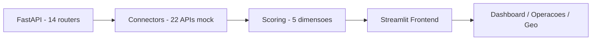

# Architecture - Tarpon

## Fluxo

## Stack
- Backend: FastAPI 0.3.0, 77 arquivos, 14 routers, 22 conectores (tudo mock api.exemplo.com)
- Frontend: Streamlit, componentes embarques, filtro_premium, market_intel
- Scoring: base, comercial, compra_imediata, importacao, internacionalizacao, logistico

## APIs mock
Todas as 20+ APIs (ComexStat, Bacen, IBGE, ViaCEP, Nominatim, Overpass, OpenCorporates, Companies House, FleetMon, GDELT, OpenWeather, GitHub, UN Comtrade, World Bank, Wikidata, etc.) apontam para `https://api.exemplo.com/*` configurável via `.env`.

## Persistência
- Sem DB próprio no repo - dados via APIs externas mock e cálculos em memória
- Cache via `connectors/cache.py` quando real
